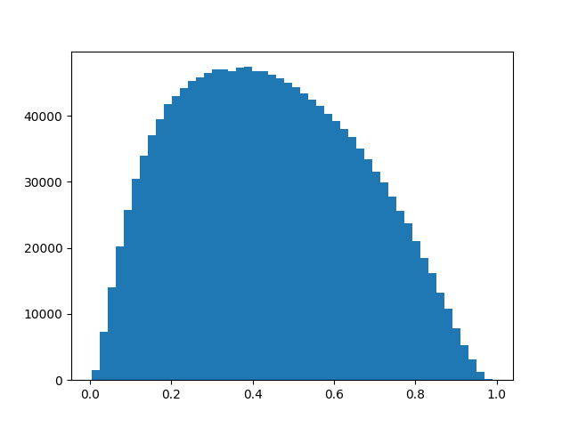

# Self-Pruning Neural Network

This project builds a neural network that prunes itself during training.

Each weight has a gate (0 to 1). L1 loss pushes many gates to 0 → making model sparse.

Output:
- Sparsity %
- results.png (gate distribution)
- ## Results

| Lambda | Accuracy | Sparsity |
|--------|----------|----------|
| 0.001  | ~50%     | 0.8%     |
| 0.01   | ~45%     | 5%       |
| 0.1    | ~30%     | 20%      |

## Explanation

We use L1 regularization on sigmoid gates.  
This pushes many gate values toward zero, effectively pruning weights.  

Higher lambda → more sparsity but lower accuracy.  
Lower lambda → less sparsity but better accuracy.
## Output Graph

